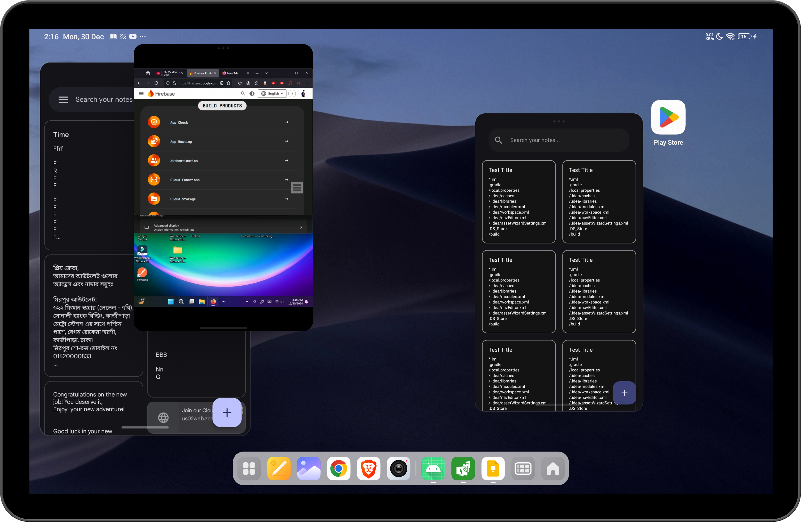
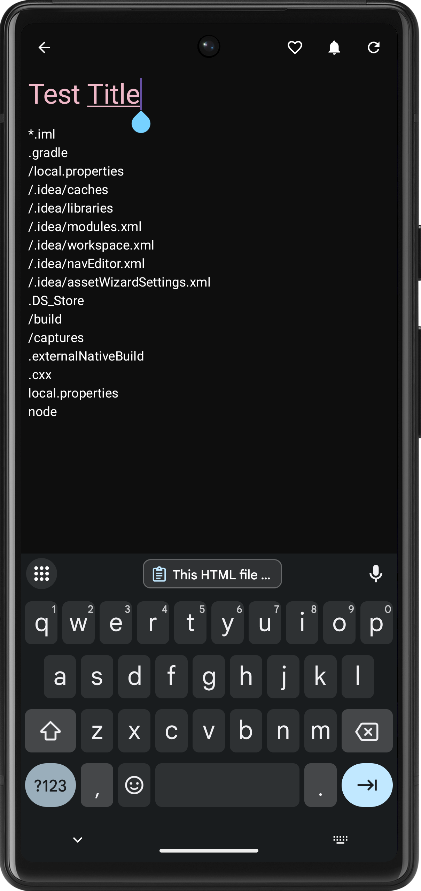
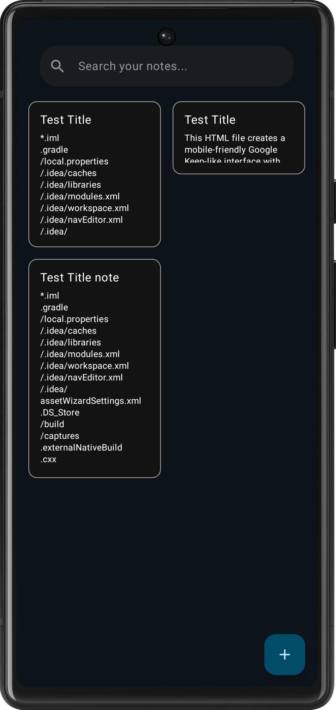

# Keep - A Secure Note-Taking App


NOTE: This app is under construction 🛠️

Keep is a note-taking app focused on data security, with no reliance on the internet. It provides features for syncing with your PC via local Wi-Fi, and it allows backup & restore functionality secured by a password for privacy.

---

## Features:

- **Local Syncing with PC**: Sync your notes with your PC over local Wi-Fi for backup and access across devices.
- **Backup & Restore with Password**: Secure your notes with password encryption for backup and restoration.
- **Offline**: All data stays secure on your device; no internet connection is required.
- **Dark Mode**: Provides a modern dark mode UI for comfortable viewing.
- **Search Notes**: Easily search and find your notes using a custom search bar.
- **Secure Storage**: Your notes are encrypted locally using AES encryption.

---

## Screenshots:





---

## How to Use:

### Backup Notes:

1. Open the app and go to the **Settings** menu.
2. Tap on the **Backup** button.
3. You will be prompted to enter a **password** for the backup.
4. Once the password is provided, the app will encrypt your notes and create a backup file stored locally on your device.
5. This file can be restored anytime using the same password.

### Restore Notes:

1. Open the app and go to the **Settings** menu.
2. Tap on the **Restore** button.
3. Enter the **password** you used for the backup.
4. If the password is correct, your notes will be decrypted and restored.

### Sync Notes with PC:

1. Connect your phone and PC to the same local Wi-Fi network.
2. Open the app on your phone and go to the **Sync** section.
3. Follow the on-screen instructions to sync your notes with your PC.

---

## Installation:

1. Clone the repository:
   ```bash
   git clone git@github.com:rasel-mahmud-dev/keep-note.git
   ```

2. Open the project in Android Studio.
3. Ensure you have the required dependencies:
4. Build and run the app on your Android device.

---

## Dependencies:

- **Gson**: For serializing and deserializing the notes data into JSON format.
- **AES Encryption**: For securing backup files.
- **Android Security Crypto Library**: To handle password encryption for backup.

---

# NOTE: This app is under construction  😐